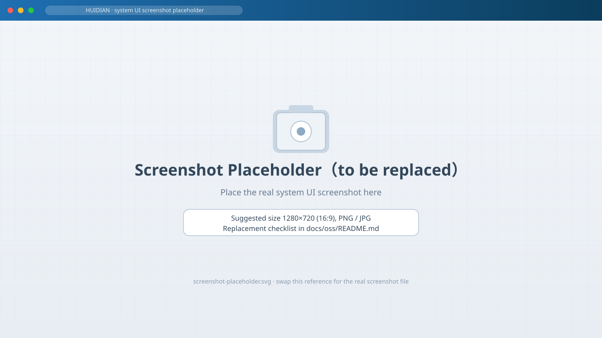
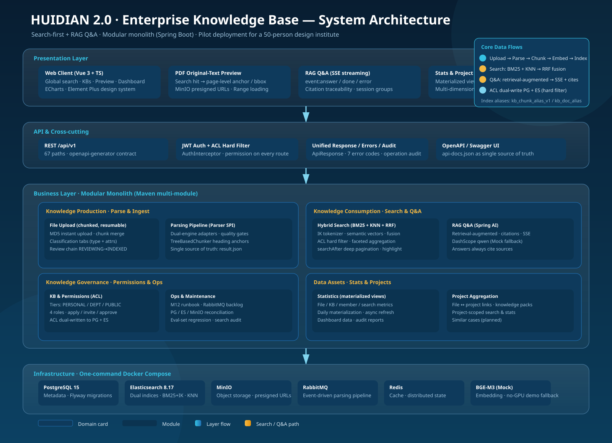
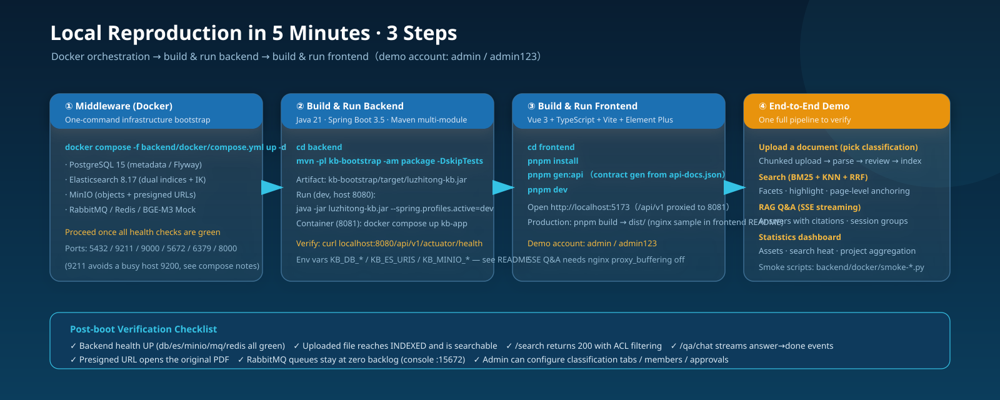
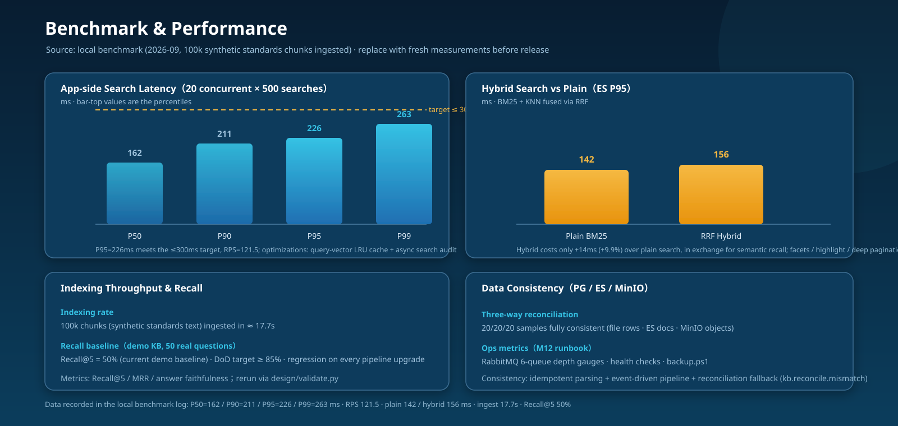

<div align="center">

# HUIDIAN · Enterprise Knowledge Base

**慧典 · 企业智能知识库**

From a searchable archive to the "second brain" of an engineering design institute — every standard traceable, every case reusable, every lesson preserved.

[]()　[]()　[]()　[]()　[]()　[]()

</div>

---

## 📸 Screenshot Preview

> Placeholder images — replace with real UI screenshots before release. See the replacement checklist in [`docs/oss/README.md`](docs/oss/README.md).

<p align="center">
  
</p>

## 🖥️ Demo Walkthrough (video)

> 🎬 **Video placeholder** — record a 15–30 s walkthrough (search → facets → deep pagination → SSE Q&A with citations)
> and save it as `docs/oss/assets/demo-video.mp4` (the README references it automatically).
> Checklist: [`docs/oss/README.md`](docs/oss/README.md).

<p align="center">
  <video width="860" controls poster="docs/oss/assets/screenshot-placeholder.svg">
    <source src="docs/oss/assets/demo-video.mp4" type="video/mp4">
    Your browser does not support the video tag — a recorded walkthrough will be published here.
  </video>
</p>

## ✨ Highlights

| Capability | Description |
|---|---|
| 🔍 **Hybrid Search** | BM25 + KNN + RRF fusion (IK Chinese tokenizer), ACL hard-filtering at query time, faceted aggregation, highlighting, searchAfter deep pagination, and page-level original-text anchoring |
| 📑 **Standards-aware Parsing** | Parser SPI with dual-engine adapters, garbled-text cleaning, quality gates, `TreeBasedChunker` (heading-anchored chunking, tables as standalone blocks, cross-page blocks preserved), single source of truth `result.json` |
| 🏛️ **Knowledge Governance** | Three-tier knowledge bases (PERSONAL / DEPT / PUBLIC), classification tabs (file types + attribute templates), four member roles (owner/admin/member/viewer), apply/invite/approve workflow, ACL written to both PG and ES |
| 💬 **RAG Q&A** | Spring AI + SSE streaming (`event:answer → done`), answers always carry citations, session grouping, automatic Mock fallback when no LLM key is configured |
| 📊 **Statistics & Ops** | Materialized-view statistics + ECharts dashboard, project aggregation, health checks, RabbitMQ backlog monitoring, PG/ES/MinIO reconciliation, full audit trail |
| 🛡️ **Engineering & Security** | Modular monolith (Maven multi-module), Flyway versioned migrations, unified error codes (40001–50001), JWT auth, OpenAPI contract as single source of truth, 141 unit tests |

## 🏗️ System Architecture

<p align="center">
  
</p>

- **Modular monolith**: Maven modules split by domain boundary (`kb-web / kb-file / kb-parser / kb-search / kb-vector / kb-job / kb-qa / kb-storage / kb-auth / kb-common / kb-eval / kb-bootstrap`) — ready to be decomposed along module boundaries when needed;
- **Search-first + RAG Q&A**: parsed artifacts are vectorized and written to two ES indices (`kb_chunk_alias_v1` + `kb_doc_alias`); BM25 and KNN are fused via RRF; Q&A assembles context from search results and enforces citation traceability;
- **Event-driven parsing pipeline**: `parse → enrich → review → vector` driven by RabbitMQ (local channel in dev), every step idempotent and retryable;
- **Hard permission filtering**: ACL is dual-written to PG and ES; search queries inject ACL filters at query-build time, eliminating TOCTOU.

## 🚀 One-Click Local Demo (Docker Compose)

> **Run the full system — backend + frontend — with prebuilt artifacts. No source code, no build steps.**

```bash
# ① Start all 7 services (frontend + API + middleware)
docker compose up -d
#    → UI & API: http://localhost:8081/api/v1/   (dev profile: no login required, guest access)

# ② Seed synthetic demo documents (optional — validates the search & Q&A loop)
bash release/scripts/seed-demo.sh
```

- **Prebuilt artifact**: `release/huidian-kb.jar` — backend + frontend packaged as one runnable jar (Java 21, zero source code required);
- **Demo data**: `release/demo-docs/*.txt` — synthetic sample documents only, **no organization data**, safe to share;
- **Deployment topology** (below): Docker Compose, 7 services — PostgreSQL / Elasticsearch / MinIO / RabbitMQ / Redis / BGE-M3 mock embedding / kb-app, each with health checks;

<p align="center">
  
</p>

> **Source availability**: the complete backend/frontend source and a from-scratch reproduction will be published
> with the **full open-source release** after the planned knowledge-graph upgrade (see [ROADMAP](ROADMAP.md) · P5).
> Issues, discussions and architecture feedback are welcome in the meantime.

## 🧰 Tech Stack

| Layer | Choice |
|---|---|
| Language / Runtime | Java 21 (bytecode locked), TypeScript 5 |
| Backend | Spring Boot 3.5.6, Spring AI 1.1, MyBatis-Plus 3.5.15, Flyway 11 |
| Search | Elasticsearch 8.17 (elasticsearch-java 8.18), BM25 + IK, KNN, RRF fusion, searchAfter |
| Storage | PostgreSQL 15 (metadata), MinIO (objects + presigned URLs) |
| Middleware | RabbitMQ (event-driven pipeline), Redis (cache / distributed state) |
| AI | BGE-M3 embedding (Mock service without GPU), DashScope qwen (compatible-mode, Mock fallback) |
| Frontend | Vue 3.5 + Vite 6 + Element Plus + Pinia + ECharts 5.6 (on-demand chunks) |
| Contract | OpenAPI (`frontend/api-docs.json` as single source of truth, openapi-generator 7.24 TS SDK) |
| Deployment | Docker Compose one-click (7 containers), JDK 21 JRE image, health checks, backup scripts |

## 📁 Repository Layout

```
.
├─ README.md / LICENSE (Apache-2.0) / ROADMAP.md
├─ docker-compose.yml        # one-click demo: 7 services, prebuilt jar, health checks
├─ release/
│  ├─ huidian-kb.jar         # prebuilt backend+frontend (Java 21, no source required)
│  ├─ demo-docs/             # synthetic sample documents (safe to share)
│  └─ scripts/seed-demo.sh   # optional: seed the demo knowledge base
├─ es/ bge-m3-mock/          # ES config (IK plugin) & embedding mock service
└─ docs/
   ├─ oss/           # open-source assets — architecture / quickstart / benchmark diagrams, screenshot checklist
   ├─ adr/           # architecture decision records (ADR-001..003)
   ├─ algorithms/    # standalone algorithm sketches (RRF fusion, dependency-free)
   └─ api/           # sanitized public OpenAPI subset (search + streaming Q&A)
```
> The full multi-module source (`backend/` · `frontend/` · `design/`) is kept private until the P5 full release — see [ROADMAP](ROADMAP.md).

## 📈 Benchmark & Performance

<p align="center">
  
</p>

| Metric | Result | Method |
|---|---|---|
| App-side search latency | **P50=162 / P90=211 / P95=226 / P99=263 ms**（target ≤ 300 ms） | 20 concurrent × 500 searches, 100k chunks, local benchmark |
| Throughput | RPS = 121.5 | same run |
| BM25 vs hybrid search | P95 142 ms → 156 ms（+9.9% for semantic recall） | BM25 vs BM25+KNN+RRF |
| Indexing rate | 100k chunks in ≈ 17.7 s | synthetic standards corpus |
| Recall baseline | Recall@5 = 50% (demo KB, 50 real questions) | DoD target ≥85%, regression as eval set grows |
| Data consistency | 20/20/20 reconciled (PG / ES / MinIO) | reconciliation job |
| Unit tests | 141 all green | `mvn -B test`（baseline was 59, grown with features） |

## 🗺️ Milestones & Roadmap

- **P1 – MVP (done)**: M0 engineering base → M1 search closed loop → M2 parsing pipeline → M3 metadata enrichment → M4 facets & statistics → M5 project aggregation → M6 KB/upload → M7 permissions & review → M8 dashboard → M9 ops & security → M10 dual-engine import → M11 RAG Q&A → M12 runbook & monitoring → M13 contract cleanup & feature backfill (classification tabs / KB CRUD / member approval / parse-result details).
- **P2–P4 (planned)**: BGE-Reranker, knowledge-graph enhancement, industry knowledge packs, multi-tenancy hooks (module boundaries already reserved).

## 🧠 Architecture Decision Records (ADR)

Why these choices? Written down, not assumed — see [`docs/adr/`](docs/adr/):

| ADR | Decision |
|---|---|
| **ADR-001** | Why Elasticsearch instead of a pure vector database (BM25 + KNN + RRF in one engine) |
| **ADR-002** | Modular monolith over microservices (evolution boundary reserved) |
| **ADR-003** | Event-driven parsing pipeline (RabbitMQ, after-commit publishing, idempotent workers) |

## 🧩 Algorithm Notebook

Small, dependency-free implementations of the core retrieval algorithms — [`docs/algorithms/`](docs/algorithms/):

- `rrf-fusion.java` — Reciprocal Rank Fusion: rank-based fusion for hybrid search (no score normalization, no per-engine tuning).

## 📚 Documentation

- Asset index & screenshot replacement checklist: [`docs/oss/README.md`](docs/oss/README.md)
- Architecture decision records: [`docs/adr/`](docs/adr/)
- Algorithm notebook: [`docs/algorithms/`](docs/algorithms/)
- Sanitized public API subset: [`docs/api/openapi-demo.yaml`](docs/api/openapi-demo.yaml)
- Roadmap & full-release plan: [`ROADMAP.md`](ROADMAP.md)

## 📸 Screenshot Replacement Checklist (before release)

All UI images in this README are placeholders. Before publishing / resume / interview use, replace them with real screenshots per the checklist in [`docs/oss/README.md`](docs/oss/README.md), and update the benchmark figure with fresh numbers if re-measured.

## ⚖️ License & Source Availability

- **License**: [Apache-2.0](LICENSE)
- **Source availability**: this repository intentionally publishes *presentation assets only* — architecture diagrams, architecture decision records, algorithm notebooks, benchmark summaries and the landing page. The core backend implementation is kept private as a deliberate professional IP-boundary decision: the system was architected and engineered for a real organization's pilot, and its codebase, data and internal design documents are not part of this public repository.
- Architecture & implementation references: source-level study of RAGFlow / Dify chunking (`docs/01-调研与竞品分析/`)
- Embedding model: BGE-M3 (Mock service in the demo environment; swap in a real model service in production)

> This repository is an engineering portfolio project: search, parsing, permissions and ops were all built from scratch. Stars / Issues / PRs are welcome.
